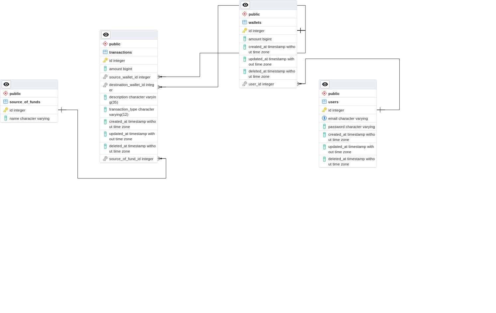

# assignment-golang-backend

## Project Description
This project is an implementation of an e-wallet app where users can topup and transfer funds with ease.

This project uses golang, gin, postgresql, bcrypt, jwt, and swagger

Erd Diagram

## Project Setup
To start this project, first you can download this project and run **go get ./...** 

Then, you can Setup the environment Variable by creating .env file from .env.example file and customize it however you like.

### Database Setup
 - First, You need to create a database, I name my db with wallet_db_ernest

With PgAdmin
 - You can right click in your created db from previous step in pgAdmin, and choose restore. Then you choose the file from db folder, named, db-dump.sql

On A side note, this db dummy data has 5 email & password pair. The password, however, are hashed

- don@email.com password
- adel@email.com hahahihi
- ship@email.com ship123
- myadmin@email.com admin123
- brad@email.com brad456

### Done Requirements
- Authentication and Authorization
  - Register
  - Login

- List of transactions
  - default 10, with query params combined

- Topup
  - Credit to Wallet
  - Amount validation
  - Description formatting
  - Record to transactions

- Transfer
  - Negative case
  - Body validation
  - Record to transactions  

- Users detail With Auth Middleware

- Unit Test
  - Usecase
    - Register and login 
    - Get Transactions
    - Topup & Transfer (95.7% on transfer)
  - Handler
    - No Route
    - user handler (login, get detail, register)
    - wallet handler (topup, transfer)
    - Body and Auth middleware test is implicit with route http request (400 bad request test cases)
    - Transaction list
  - Utils
    - Hash Utils test (not complete)
    - Utils test (not 100%)

- Swagger Documentation (served statically on /documentations route)

- ERD
- DB seeding

### Not Done
- Pagination optionals
- Reset Password optionals

